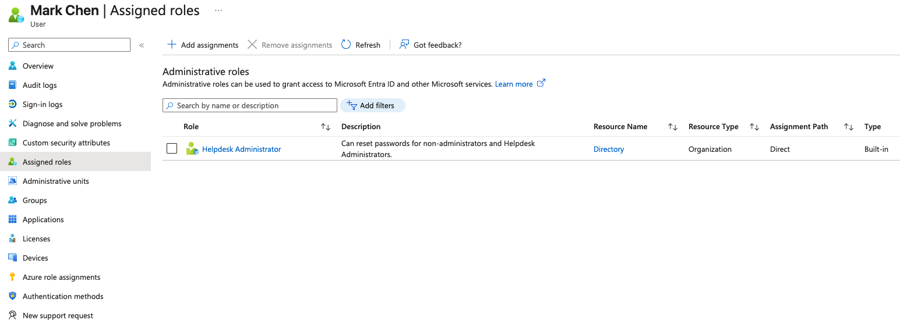

## What I did
Assigned David Chen the built-in "Helpdesk Administrator" role instead of Global Administrator, giving him only the permissions needed for IT support tasks (e.g. password resets, limited user management).
## Screenshots

## Why it matters
This demonstrates least-privilege access in practice: even though David works in IT, his actual job function only requires helpdesk-level permissions, not full administrative control over the tenant. Over-provisioning access based on department rather than actual job need is a common audit finding.

