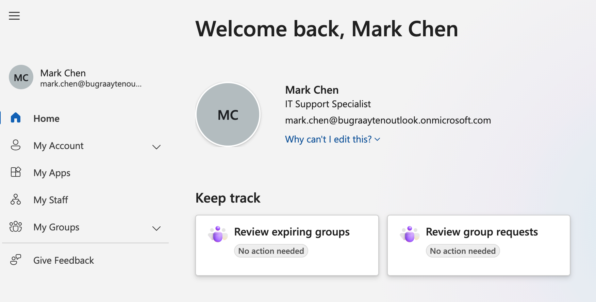
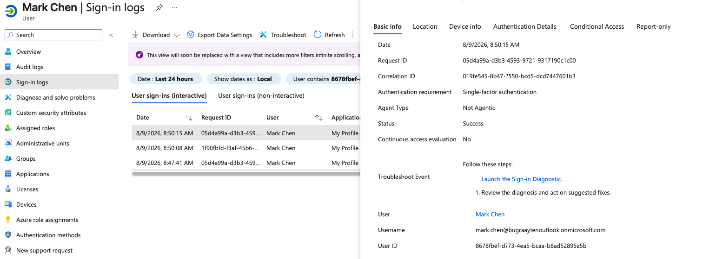
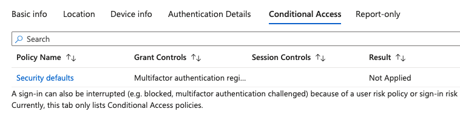
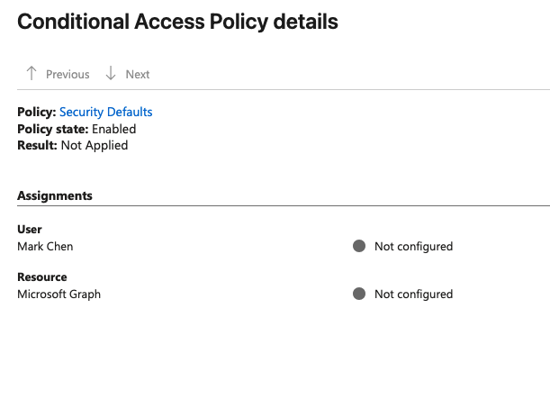
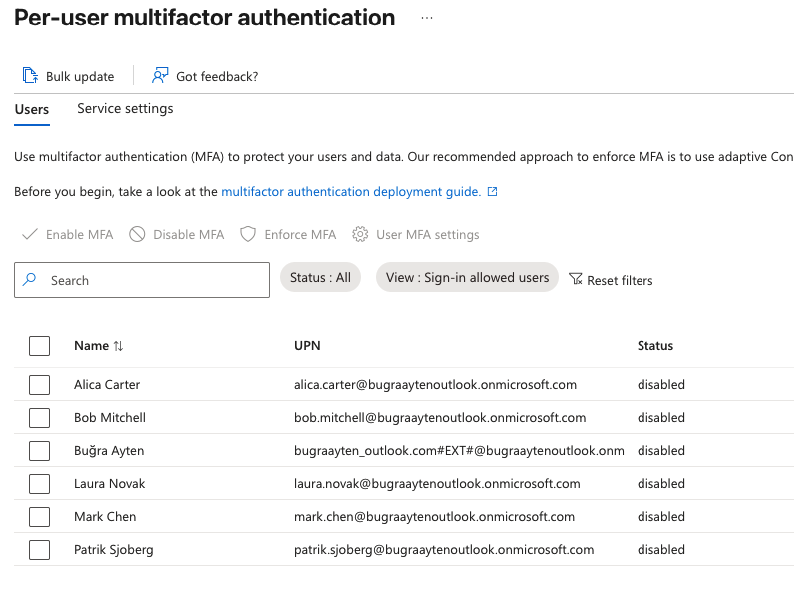
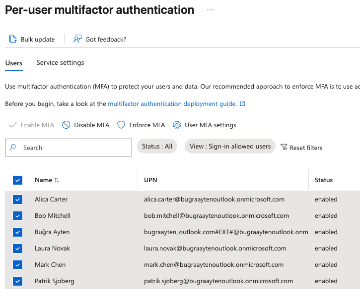
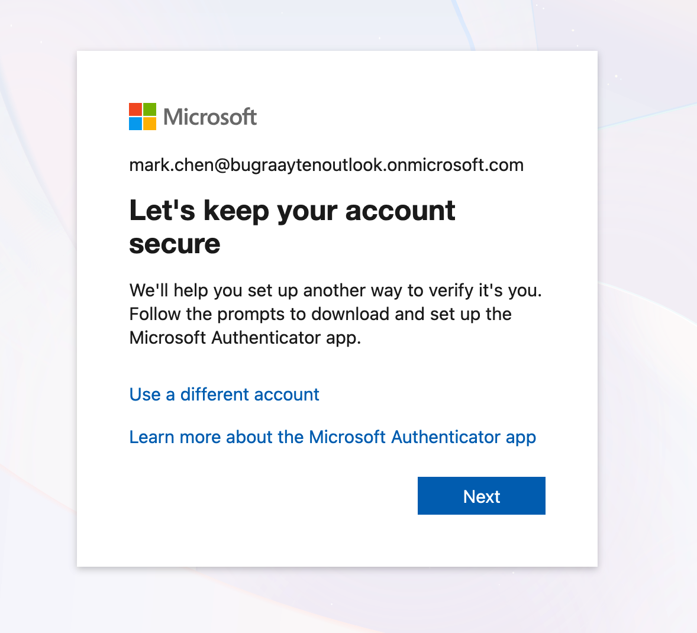

## What I did
Enabled Security Defaults and tested sign-in as Mark Chen. Initial sign-in logs showed "Result: Not Applied," indicating MFA wasn't yet enforced due to the 14-day grace period. Enabled per-user MFA to force immediate enforcement and re-tested — sign-in was then correctly blocked pending MFA registration.
## Screenshots

Succesfully logged in without MFA

Logs
1

2

3

I enabled per-user MFA to enforce.

Sign-in attempt after enforcing MFA 

## Why it matters
Log showed "Single-factor authentication" — MFA wasn't yet enforced due to the 14-day grace period. Shows the difference between a control being "on" vs. actually "enforced"

Demonstrates the difference between a control being configured versus actively enforced, and shows how to identify and resolve that gap — a real control-testing and remediation exercise relevant to IAM and audit work.